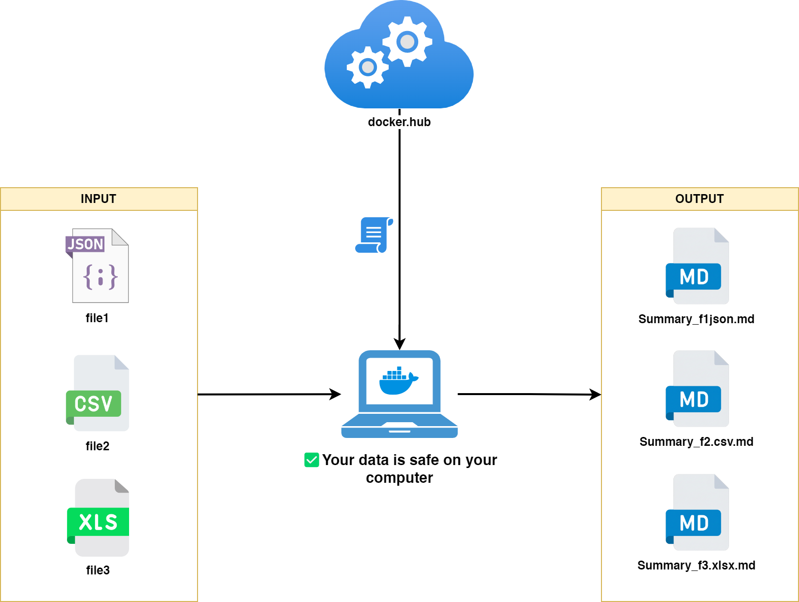

# 📊 Data Summarizer for LLMs

> **Generate compact, context-rich dataset summaries for LLM Context Injection.**
> *Optimized for Gemini, ChatGPT, and Claude context windows.*


---

## Why this tool?

### 🔒 Privacy First — Your data never leaves your machine

No API calls, no cloud uploads. The container runs entirely locally and processes your files in-memory. Nothing is sent anywhere.

### 📂 Batch Processing — One folder, all your files

Drop all your datasets (CSV, Excel, JSON, Parquet) into a single folder and run once. Every file gets its own summary.

### ⚡ Blazing Fast — Powered by Polars (Rust)

Analysis is handled by [Polars](https://pola.rs/), a Rust-based DataFrame engine. Even large files are processed in seconds.

---



---

## 🚀 Quick Start

**No installation required. Docker only.**

### Step 1 — Create your working folders

```bash
mkdir -p input output
```

That's it — `input/` for your files, `output/` for the summaries.

### Step 2 — Drop your files

Copy any `.csv`, `.xlsx`, `.xls`, `.json`, or `.parquet` files into `input/`.

### Step 3 — Run

**Linux / macOS:**

```bash
docker run --rm \
  -v "$(pwd)/input:/app/data/input" \
  -v "$(pwd)/output:/app/data/output" \
  abguven/data-summarizer:latest
```

**Windows (PowerShell):**

```powershell
docker run --rm `
  -v "${PWD}/input:/app/data/input" `
  -v "${PWD}/output:/app/data/output" `
  abguven/data-summarizer:latest
```

> **Want to keep execution logs?** Add `-v "$(pwd)/logs:/app/logs"` to the command (create the `logs/` folder first with `mkdir logs`).

That's it. A `SUMMARY_<filename>.md` file is generated in `output/` for each file processed.

---

## 📄 Output Example

Given a file `employees.csv`, the tool generates `SUMMARY_employees.csv.md`:

```markdown
# 📊 Dataset Summary: employees.csv
- **Rows:** 1000
- **Columns:** 5

## 🧱 Column Details
| Column    | Type    | Missing | Unique | Stats / Distribution                | Examples               |
|-----------|---------|---------|--------|-------------------------------------|------------------------|
| name      | String  | 0.0%    | 1000   |                                     | Alice, Bob, Charlie    |
| age       | Int64   | 2.0%    | 45     | Min:18 Max:75 Avg:42 `▂▃▅█▅▃▂`     | 25, 30, 35             |
| city      | String  | 0.5%    | 23     |                                     | Paris, Lyon, Marseille |
| salary    | Float64 | 0.0%    | 850    | Min:2000 Max:9500 Avg:4800 `▂▃▄▅▆` | 3200.0, 4500.0         |
| is_active | Boolean | 0.0%    | 2      |                                     | true, false            |
```

Paste this Markdown directly into your LLM prompt — no file upload needed, no tokens wasted.

---

## 📦 Technical Specs

| Feature | Detail |
| :--- | :--- |
| **Base Image** | `python:3.14.3-slim` (Debian) |
| **User** | `appuser` (UID 1000 / GID 1000) — non-root |
| **Supported Formats** | `.csv`, `.parquet`, `.json`, `.xlsx`, `.xls` |
| **Engine** | Polars (Rust-based) |
| **Image Size** | ~90MB compressed (multi-stage build) |

---

## 🔍 Troubleshooting

### `PermissionError` on Linux / macOS

**Symptom:**

```
PermissionError: [Errno 13] Permission denied: '/app/data/output/...'
```

**Cause:** On Linux and macOS, if the `output/` folder doesn't exist before running the container, Docker creates it automatically as `root:root`. The container runs as a non-root user (`appuser`) and cannot write to it.

**Fix:** Always create the folders yourself before running the container:

```bash
mkdir -p input output
```

---

## 👩‍💻 For Developers

This section is for contributors who want to modify the source code.

### Setup

```bash
git clone https://github.com/abguven/data-summarizer-llm.git
cd data-summarizer-llm

pip install -r requirements.txt
python src/summarize_dataset.py
```

> Note: when running locally without Docker, adjust the `INPUT_DIR` / `OUTPUT_DIR` paths inside `src/summarize_dataset.py`.

### Makefile commands

| Command | Description |
| :--- | :--- |
| `make build` | Build the Docker image locally (`data-summarizer:local`) |
| `make demo` | Copy sample data into `data/input/` and run the local image |
| `make test` | Run the functional test suite against the local image |
| `make help` | List all available commands |

### Workflow

```bash
# 1. Build your local image after making changes
make build

# 2. Smoke test with sample data
make demo

# 3. Run the full test suite
make test
```

### Contributing

Feel free to open issues or submit PRs. Ideas welcome:

- SQL database support
- Additional output formats (JSON, HTML)
- More advanced statistics (percentiles, correlation)

---

*Maintained by [abguven](https://github.com/abguven).*
